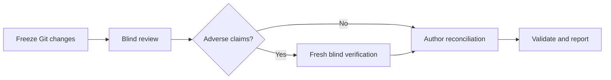

# Independent Reviewer

Independent model review for a frozen Git changeset.

Independent Reviewer is a local CLI that sends bounded review evidence to an
external model through OpenRouter. It runs a blind assessment before revealing
the author's explanation, challenges adverse claims in a fresh blind context,
and produces validated JSON and Markdown reports.

> **Pre-release:** currently built and run from source. No package-registry
> release or hosted pull-request bot yet.

## Why use it?

- **Independent inputs.** Reviewers never receive the implementation chat,
  agent memory, or author explanation during the initial assessment.
- **Frozen evidence.** Git scope, diffs, supporting context, rules, and artifact
  identities are captured before model calls.
- **Challenged findings.** A fresh author-blind verifier checks preliminary
  findings, evidence gaps, and limitations before reconciliation.
- **Bounded runs.** Dry-run previews scope, token admission, routing, and maximum
  reserved cost without credentials or provider calls.
- **Fail-closed reports.** Missing coverage, invalid evidence anchors, malformed
  responses, and unknown usage remain visible instead of becoming a clean result.

Review output supports engineering judgment. It is not proof of correctness or
deployment readiness.

## How it works



Default scope combines committed branch changes with staged, unstaged, and
selected untracked files. The model receives only captured evidence; it cannot
run tests or read arbitrary repository files. Every reviewable text file gets
deterministic file-level context; JavaScript, TypeScript, Python, Go, and Java
also get Tree-sitter declaration context.

## Quick start

Requires Git, Node.js 24, npm 11, and an OpenRouter API key for live reviews.

### 1. Build the CLI

```sh
git clone https://github.com/dills122/independent-reviewer.git
cd independent-reviewer
npm ci
npm run build
```

### 2. Save model and cost settings

```sh
node dist/src/cli.js init \
  --repo /path/to/target-repository \
  --model openai/gpt-oss-120b \
  --max-cost 0.05
```

Settings are stored in the target repository's private Git metadata, not in a
tracked project file. Inspect them with:

```sh
node dist/src/cli.js config show --repo /path/to/target-repository
```

### 3. Describe the change

Create a short Markdown file such as `/absolute/path/to/author-overview.md`:

```md
# Author overview

## Intent
What this change should accomplish.

## Approach
How the implementation works.

## Known gaps
Checks or cases not covered.

## Challenge points
Areas the reviewer should examine closely.
```

### 4. Preview the review

```sh
node dist/src/cli.js review \
  --repo /path/to/target-repository \
  --base main \
  --standards "$PWD/examples/standards.javascript-typescript.json" \
  --author /absolute/path/to/author-overview.md \
  --dry-run
```

Dry-run captures the real scope and checks admission without reading an API key,
making a provider call, or claiming a review instance. Use the actual base ref
for your change.

### 5. Run the review

Keep the API key in an ignored `.env` file:

```dotenv
OPENROUTER_API_KEY=replace-with-your-key
```

Then repeat the review without `--dry-run`:

```sh
node --env-file=.env dist/src/cli.js review \
  --repo /path/to/target-repository \
  --base main \
  --standards "$PWD/examples/standards.javascript-typescript.json" \
  --author /absolute/path/to/author-overview.md
```

The Markdown report defaults to
`<target-repository>/.review-runs/<snapshot-id>/review/report.md`.

## Configuration

Start with `init`, one model, and a maximum cost. Add more policy only when the
review needs it:

| Input | Purpose |
| --- | --- |
| `--standards` | Select rules and path applicability. The bundled JavaScript/TypeScript profile is an example, not a language restriction. |
| `--author` | Supply intent, approach, known gaps, and challenge points. It stays hidden until final reconciliation. |
| `.independent-reviewer/rules.md` | Add optional reviewer-specific guidance from the frozen base revision. |
| `--config` | Control advanced routing, privacy, retry, token, and cost policy with versioned JSON. |

Repository guidance used by Codex, Claude, Gemini, Kiro, GitHub Copilot, and
Cursor is discovered from the frozen base revision. Repository text remains
untrusted evidence and cannot change runner permissions, provider policy, or
budget limits.

See the [setup and usage guide](docs/user-guide.md) for custom standards,
advanced configuration, privacy controls, artifacts, retries, and the lower-level
requirements workflow.

## Current scope

- Local, source-built CLI; hosted pull-request and merge-request adapters are
  deferred.
- Static review of captured evidence; no test execution or arbitrary file access.
- Explicit standards and author files remain required for the shortest review
  flow.
- Review artifacts may contain private source and must remain ignored under
  `.review-runs/`.

## Documentation

- [Setup and usage](docs/user-guide.md)
- [Architecture and roadmap](docs/architecture-and-roadmap.md)
- [Review protocol](docs/review-protocol-spec.md)
- [Contributing](CONTRIBUTING.md)
- [Bug reporting](docs/bug-reporting.md)
- [Security policy](SECURITY.md)

Versioned portable schemas live in [`schemas/`](schemas/).

## Development

```sh
npm ci
npm run check
python3 -B scripts/check-ai-context.py --ci
```

Run `npm run schemas:write` after changing a runtime contract. See
[repository governance](docs/repository-governance.md) for merge rules and
required checks.
