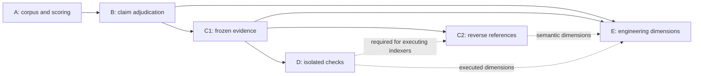

# Correctness and engineering review delivery plan

Status: Stage A started; research-informed implementation sequence, not shipped product behavior.
Parent: [#159](https://github.com/dills122/independent-reviewer/issues/159).
Baseline: `6073c2f`. Planning requested 2026-09-14.

## Outcome and scope

Establish measurable finding accuracy, then expand review to cross-file behavior
and broader engineering obligations. Preserve frozen evidence, blind assessment,
author reconciliation, explicit uncertainty, bounded cost, and compatible modes.

Three gates remain separate: runner obeys contracts; findings follow from evidence;
review covers relevant obligations. Passing runner tests cannot substitute for
semantic evaluation. Static assessment and passing checks cannot establish that
software is bug-free or ready for every deployment.

Companion documents:

- [Current-state assessment](../research/2026-09-14-correctness-and-engineering-review-assessment.md).
- [Evaluation protocol](2026-09-14-review-quality-evaluation-protocol.md).
- [Deep research and decision evidence](../research/2026-09-14-engineering-review-deep-research.md).
- [Existing adverse-claim plan](2026-09-12-verdict-affecting-claim-verification-plan.md).

## Delivery order

| Stage | Issue | Deliverable | Start dependency | Promotion gate |
| --- | --- | --- | --- | --- |
| A | [#160](https://github.com/dills122/independent-reviewer/issues/160) | Reproducible corpus, scorer, case-level quality baseline | Existing packets/reports | Frozen labels, offline scorer qualification, no oracle leakage |
| B | [#161](https://github.com/dills122/independent-reviewer/issues/161) | Final-claim adjudication and inconclusive projection | Minimum A canaries | Unsupported claims cannot escape categories; true defects retained |
| C1 | [#162](https://github.com/dills122/independent-reviewer/issues/162) | Declaration expansion, frozen evidence service, supporting citations | A evidence fixtures; B-compatible claims | Better targeted evidence without hidden scope loss or false-positive regression |
| C2 | [#163](https://github.com/dills122/independent-reviewer/issues/163) | Reverse-reference adapter and optional semantic-index spike | C1; D for executing indexers | Measured cross-file gain; source-bound producer provenance |
| D | [#164](https://github.com/dills122/independent-reviewer/issues/164) | Isolated named checks and differential reproductions | A oracles; B/C1 result integration | Qualified isolation and distinct code/environment outcomes |
| E | [#165](https://github.com/dills122/independent-reviewer/issues/165) | Engineering dimensions and missed-defect pass | A/B/C1; C2/D only where required | Useful incremental findings at measured precision and cost |

Start A, then B. C1 precedes semantic indexing. D's isolation design can start
early: a build-dependent C2 implementation must wait for it. A pure adapter over
frozen input can be evaluated before D. E's scope design can also start early;
shipping extra model passes requires qualification, not only a prompt change.

## Stage A — quality baseline

### Work increments

1. Inventory existing live fixture definitions and labels. Reconstruct useful
   cases as deterministic committed fixtures; private run directories are not
   prerequisites for a clean checkout.
2. Define evaluation-only case/run/score schemas and split manifests. Keep
   evaluator labels, gold fixes, and oracle-only tests outside review inputs.
3. Implement finding-level matching and accounting with hand-adjudicated mock
   reports. Include novel true findings, duplicate roots, missing reports, empty
   denominators, and incomplete labels.
4. Freeze a bounded development/holdout corpus and one baseline configuration.
   Paid sampling is a separate explicitly authorized experiment.

Progress: increment 1 now has a package-private 20-case synthetic corpus, clean-checkout fixture
reconstruction, fixed `smoke`/`standard`/`full` suites, group and exact-case selection, and bounded
live-run admission. Run artifacts preserve terminal state and cost uncertainty. Increment 2 remains
open: corpus/split contracts, holdout allocation, and finding-level scoring are not implemented.
See the [matrix operator guide](../../evaluation/README.md).

Initial design target: 12 defect/clean pairs and six uncertainty/adversarial
controls, approximately 30 cases. Target is a manageable baseline, not a claim
of statistical adequacy. Retain entire families in one split; include several
small real regressions with license and environment provenance.

### Ownership

Proposed package-private `evaluation/` owns fixtures, evaluator-only contracts,
scoring, and run manifests. Reuse runtime packet/report readers. Do not put
product evaluation logic in bootstrap-owned `scripts/`, or publish evaluator
labels through product schema exports.

### Done when

Clean checkout can reconstruct cases and score fixed reports offline. Labels
cannot enter reviewer messages, all planned attempts receive terminal records,
and metrics retain their numerators, denominators, and unresolved adjudications.
Detailed scoring rules live in the companion evaluation protocol.

## Stage B — complete adjudication

### Contract decisions before code

Inventory all semantic inputs to outcome, including final findings, changed
premises under reused IDs, standards conflicts/unassessed status, uncertainty,
and status-bearing summary prose. Bind judgments to claim content, obligation,
scenario, and exact evidence, not merely an identifier.

Define explicit projection:

| Judgment | Finding eligibility | Outcome effect |
| --- | --- | --- |
| Demonstrated violation | May survive | Severity/enforcement policy applies |
| Rejected violation | Withdraw | No residual adverse claim in summary |
| Inconclusive violation | Uncertainty, not demonstrated defect | Block assessment only if needed to decide an in-scope obligation |
| Rejected blocking uncertainty | Resolve | Cannot veto outcome elsewhere |
| Demonstrated/inconclusive necessary uncertainty | Retain visibly | Assessment remains incomplete under mode policy |

Use a fresh post-author verifier only for new or materially changed adverse
claims. Relevant author content is labeled evidence; original blind stages stay
author-free. Changes in semantic premise require revalidation even when source
finding IDs stay constant. Equivalent wording alone should not create endless
verification; define bounded canonical claim fields and explicit continuity
judgment rather than attempting semantic equivalence through string heuristics.

Reserve the additional worst-case path before first submission. Define durable
stage events, request digests, policy versions, and resume eligibility. If final
verification fails, preserve completed stages and explicit incomplete outcome;
never publish an unchecked successful report. Normal clean path skips the call.

### Ownership and tests

Add focused adjudication/projection modules under `src/orchestrator/` and
`src/report/`, with versioned definitions under `src/contracts/`. Keep provider
transport outside semantic policy. Reuse existing ADR-016 work and primitives.

Required canaries: final-only false finding; changed premise with reused ID;
inconclusive finding; category escape into standards status or summary; genuine
missing evidence; true defect; author-only unsupported defense; and interrupted
post-author verification/resume. Use ordinary mock providers for deterministic
contract gates and Stage A for semantic promotion evidence.

## Stage C1 — focused frozen evidence

Deliver three independently reviewable increments:

1. Exact enclosing-declaration materialization from current context map, with
   explicit oversized/unsupported fallback and no loss of changed hunks.
2. Evidence-role contract separating changed-code primary anchors from supporting
   source citations. A supporting location explains causality without becoming
   an unrelated defect target.
3. Provider-free bounded read/search/expand service; integrate a provider tool
   loop only after frozen-source and budget behavior qualifies offline.

Captured inventory bounds the service. Cumulative worktree bytes must be copied
and admitted at preparation; immutable Git objects alone cannot reconstruct dirty
state later. Search results retain snapshot, side, path/range, digest, query,
producer, truncation/continuation, and budget state. Persist response identity
and which returned bytes were actually transmitted before accepting citations.

Secret admission applies to every additional source. Author packets, evaluator
oracles, operational credentials, and excluded files remain outside blind source
inventory. Scope selection cannot silently become whole-repository disclosure.

Compare current windows, declarations, and targeted access on identical cases.
Track quality, bytes, calls, and missing-evidence rates. Stop expansion that
adds distraction without improving relevant evidence access.

The [reviewd source study](../research/2026-09-15-reviewd-implementation-study.md)
shows a concrete exploration workflow: diff, changed file, then related caller.
Qualify that sequence using frozen evidence, with paired cases where the relevant
caller is unchanged, the branch advances after capture, and HEAD guidance conflicts
with BASE. Record requested, returned, and actually transmitted evidence separately;
a prompt asking the model to explore is not a coverage receipt. Commit messages and
reverted approaches must not enter blind evidence as author justification; any
future history input requires labeled post-blind provenance and a contract decision.

## Stage C2 — reverse references and semantic adapters

Spike a deterministic reverse-reference baseline before committing to an indexer.
Keep language-neutral relation vocabulary with explicit semantic, syntactic, and
heuristic certainty. Missing edges do not establish absent callers.

SCIP remains a candidate interchange format. Import requires source-inventory
identity, indexer/version, resolution assumptions, source range conversion, and
partial/unsupported diagnostics. An index that parses is not thereby current,
complete, or trustworthy. Record false edges and unresolved references as well
as successfully resolved ones.

Qualifier fixtures include changed helper/unchanged caller, alias, re-export,
overloaded symbol name, generated declaration, unresolved dependency, Unicode
coordinates, rename, and separate BASE/HEAD indexes. Gate any build-dependent
producer on D isolation. Select packages and exact versions only after a measured
compatibility, license, resource, and quality spike.

## Stage D — observed checks

Execution policy is operator-owned and outside reviewed content. Named checks
resolve to bounded argument arrays and a qualified backend; provider text cannot
grant command permissions. A subprocess wrapper is not a sandbox.

Backend qualification covers disposable snapshot reconstruction, host/mount
boundaries, no API secrets or host control sockets, denied or explicitly scoped
network, CPU/memory/process/disk/time/output limits, process-tree cancellation,
and cleanup after failure. Separate dependency acquisition from check execution
and record dependency/image/runtime identity. Initial backend may support one
platform; other platforms report unsupported rather than weakening isolation.

Results distinguish assertion failure, setup failure, timeout, cancellation,
unsupported environment, and not run. Ordinary exit zero does not prove an
arbitrary semantic claim. A check's assertion and valid input domain need a
trustworthy oracle; generated assertions need independent review.

Reviewd's timeout and test-provenance paths add concrete qualification cases:
start deadlines before any blocking setup/stdin/stdout operation; bound both output
streams; exercise a silent child, stalled pipe, output flood, ignored termination,
and surviving descendants. A timeout option applied after reading stdout does not
bound execution. Model-reported `tests_passed` cannot become runner evidence. Do not
auto-accept CLI trust or expose host credentials to check processes. Reuse #116 for
process-wrapper choices and #169 for the separate current Git-config preflight gap.

For regressions, execute identical checks/environment against BASE and HEAD
when meaningful. A new feature may lack comparable BASE execution. A flaky
failure remains inconclusive unless controlled evidence establishes causality;
do not repeat until desired result appears. Begin with supplied focused checks,
then evaluate generated reproductions, selected mutations, and property tests.

## Stage E — engineering review dimensions

Define explicit enabled dimensions, obligations, evidence requirements, and
outcome rules. Dimensions cover behavior, compatibility, state/concurrency,
design, verification quality, security/operations, and performance. Canonical
requirements and plans apply when supplied; inferred obligations remain labeled
and cannot invent business requirements.

Model report should distinguish demonstrated defects, mandatory violations,
optional recommendations, and uncertainty. Useful design feedback need not be
forced into defect schema. Record required scope separately from evidence
delivered, model-reported assessment, and observed checks.

Evaluate an optional fresh missed-defect pass without prior conclusions or
author rationale. It must permit finding nothing. Use bounded unit scheduling
plus cross-unit synthesis; independent per-file reviews alone miss interactions.
Adjudicate all new claims through B. Gate additional pass on incremental unique
defects, added false findings, abstention, delivery, latency, and cost.

## Existing backlog integration

| Existing work | Relationship |
| --- | --- |
| #49 and #17 component/orchestrator boundaries | Extract touched claim/evidence responsibilities; no wholesale rewrite gate |
| #123 resume validation | New stages require shared validation and resume proof; preserve prior completed artifacts |
| #133 prose bounds | Coordinate new claim text limits and schema versions; do not silently tighten old persisted artifacts |
| #113 and #116 install/process policy | Inputs to D qualification; neither proves isolation |
| #101, #103, #149 friendly operations | Separate usability track; share admission/author/report interfaces where needed |

Issue references above are in `dills122/independent-reviewer`. Their original
scope remains intact. No issue is closed by this planning work.

## Release and decision gates

Every runtime slice needs focused invariant tests, generated-schema parity,
compatible or explicitly rejected resume generations, `npm run check`, and
appropriate repository-context checks. Quality experiments use the frozen
evaluation protocol and report negative or ambiguous results too.

Before semantic promotion, predeclare model/provider policy, attempt count,
budgets, target improvement, acceptable regressions, and holdout handling.
Thresholds are product choices requiring a frozen experiment definition, not
numbers borrowed from unrelated leaderboards. Small samples support canary
qualification; they do not support sweeping reliability claims.

Architecture decisions still needed: final-claim identity/projection, evidence
inventory and citation roles, first semantic adapter, execution backend and
dependency policy, and engineering-mode outcome semantics. Record each ADR
before implementing its consumers; do not mark these proposals accepted merely
because an issue exists.

## First implementation batch

1. Reconstruct minimum A corpus and version its evaluator-only artifacts.
2. Implement deterministic scorer and leak/denominator/duplicate tests.
3. Add B regression canaries and finalize claim contract ADR.
4. Implement B projection and selective verification with budget/resume gates.
5. Freeze targeted paid qualification request; run only after authorization.
6. Select C1 experiment based on remaining evidence-sensitive misses.

No bot, hosted service, generalized agent framework, broad provider comparison,
or universal environment builder is required for this batch.
