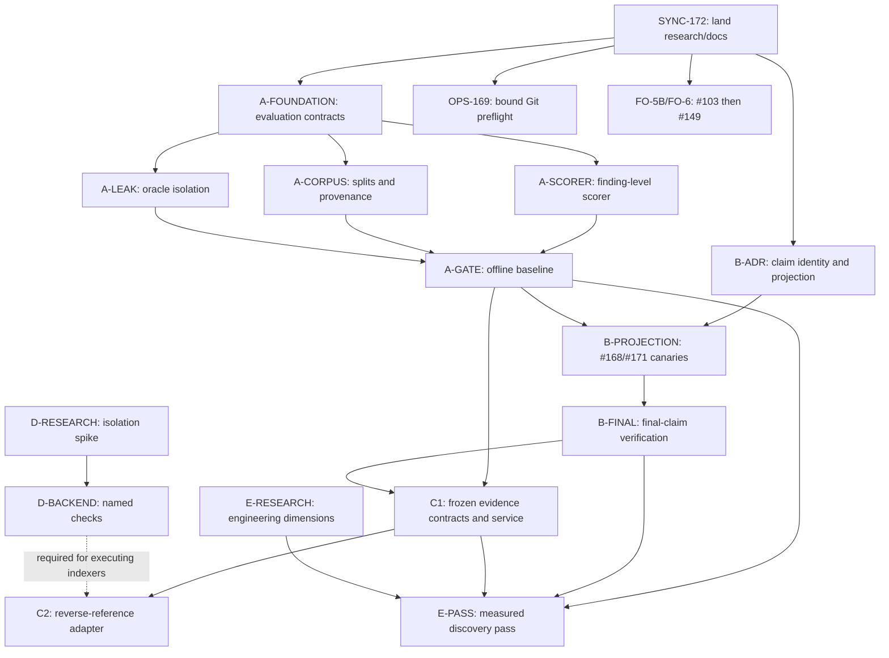

# Next-wave delivery execution index

Status: active execution index. Repository baseline is `6cc5301`, including
merged [PR #175](https://github.com/dills122/independent-reviewer/pull/175)
and [PR #176](https://github.com/dills122/independent-reviewer/pull/176).
PR #175 records final-claim adjudication design; PR #176 bounds Git
`safe.directory` discovery and closes the independent preflight hang.

Canonical scope remains in the
[architecture and roadmap](../architecture-and-roadmap.md),
[correctness delivery plan](2026-09-14-correctness-engineering-review-plan.md),
and [evaluation protocol](2026-09-14-review-quality-evaluation-protocol.md).
This file owns execution order, parallel lanes, delivery packets, and current
status; it does not replace those contracts.

## Objective and completion boundary

Turn the merged tiered matrix into finding-level quality measurement, use that
evidence to finish claim adjudication, and then expand frozen evidence and
observed verification without weakening review independence or cost controls.
Keep friendly operations and bounded reliability fixes moving in parallel.

This wave is complete when:

- a clean checkout can reconstruct and score fixed reports at finding/root level;
- false or inconclusive claims cannot escape through findings, concerns,
  standards status, summaries, blockers, or verdicts;
- `safe.directory` discovery has a bounded producer lifecycle;
- author lifecycle and remaining friendly-operations qualification are complete;
- C1 evidence contracts are decision-ready for the next implementation wave; and
- every paid experiment remains a separate, predeclared authorization.

## Current ground truth

- First 20-case paid sample completed: 19 valid reports and 18 expected verdicts.
  It is a canary result, not a scored or repeated quality baseline.
- [#171](https://github.com/dills122/independent-reviewer/issues/171) is a false
  P1 blocker on an out-of-domain, factually incorrect scenario.
- [#168](https://github.com/dills122/independent-reviewer/issues/168) tracks
  duplicate roots, unsupported author-claim dispositions, bad attribution, and
  meaningless concern text found without changing top-level verdicts.
- [#169](https://github.com/dills122/independent-reviewer/issues/169) is closed
  by PR #176 after bounded discovery, cleanup, and exact-record regression
  coverage passed independent review and CI.
- [#103](https://github.com/dills122/independent-reviewer/issues/103) and
  [#149](https://github.com/dills122/independent-reviewer/issues/149) are the
  remaining friendly-operations milestone units.
- [#70](https://github.com/dills122/independent-reviewer/issues/70) is closed as
  completed; [#18](https://github.com/dills122/independent-reviewer/issues/18)
  is closed as superseded by [#123](https://github.com/dills122/independent-reviewer/issues/123)
  and [#17](https://github.com/dills122/independent-reviewer/issues/17).

## Dependency graph

## Work packages

| ID | Issues | Owner and delivery type | Dependencies | Acceptance and verification | Status |
| --- | --- | --- | --- | --- | --- |
| SYNC-172 | [PR #172](https://github.com/dills122/independent-reviewer/pull/172) | Lead integration | PR #173 on `main` | Rebase if needed; retain research/probes; all required checks green | Complete; squash-merged as `12ee826` |
| A-FOUNDATION | [#160](https://github.com/dills122/independent-reviewer/issues/160) | Evaluation-contract worker | SYNC-172 | Version case, family split, experiment, attempt, adjudication, and score artifacts using shared primitives; labels remain evaluator-only | Remediation in progress on `codex/evaluation-artifact-contracts` after review found oracle-fragment, comparison-freeze, provider-attempt, score-binding, and chronology gaps |
| A-SCORER | [#160](https://github.com/dills122/independent-reviewer/issues/160) | Scorer worker | A-FOUNDATION | Mock reports prove root matching, duplicates, partial labels, unresolved claims, zero denominators, and delivery failures | Queued |
| A-CORPUS | [#160](https://github.com/dills122/independent-reviewer/issues/160) | Corpus worker | A-FOUNDATION | Freeze whole-family development/holdout allocation, provenance, root definitions, and expansion path toward approximately 30 cases | Queued; parallel with A-SCORER |
| A-LEAK | [#160](https://github.com/dills122/independent-reviewer/issues/160) | Isolation-test worker | A-FOUNDATION | Reject evaluator labels, fixes, oracle tests, and revealing filenames in every reviewer stage and tool result | Queued; parallel with A-SCORER |
| A-GATE | [#160](https://github.com/dills122/independent-reviewer/issues/160) | Lead integration | A-SCORER, A-CORPUS, A-LEAK | Score fixed reports from clean checkout; publish case/family metrics and frozen experiment recipe; no paid call | Blocked by Stage A units |
| B-ADR | [#161](https://github.com/dills122/independent-reviewer/issues/161), [#133](https://github.com/dills122/independent-reviewer/issues/133) | Research/ADR worker | SYNC-172; minimum canaries known | Decide claim identity, continuity, inconclusive projection, summary ownership, and text bounds before consumers | Complete; [ADR-018](../decisions/018-bind-final-claims-and-project-verified-outcomes.md) merged in PR #175 |
| B-PROJECTION | [#161](https://github.com/dills122/independent-reviewer/issues/161), [#168](https://github.com/dills122/independent-reviewer/issues/168), [#171](https://github.com/dills122/independent-reviewer/issues/171) | Contract/report worker | B-ADR, A-GATE | Pure demonstrated/rejected/inconclusive projection; exact duplicate, category-escape, out-of-domain, false-runtime-premise, and true in-domain controls | Queued |
| B-FINAL | [#161](https://github.com/dills122/independent-reviewer/issues/161) | Orchestrator worker | B-PROJECTION | Verify final-only/materially changed claims; reserve worst-case calls; persist durable events; preserve resume compatibility and incomplete outcomes | Queued; serialize contract changes with B-PROJECTION |
| OPS-169 | [#169](https://github.com/dills122/independent-reviewer/issues/169) | Snapshot worker | SYNC-172 only | Bound setup, output, cleanup, and concurrent cached waiters across all three Git wrappers; focused fake-Git tests pass | Complete; independently reviewed and merged in PR #176 |
| FO-5B | [#103](https://github.com/dills122/independent-reviewer/issues/103) | CLI/author-lifecycle worker | Compact guidance and Commander work merged | Every simple setting changes behavior; warned author opt-out and isolation/resume cases pass | In progress on `codex/author-explanation-settings` |
| FO-6 | [#149](https://github.com/dills122/independent-reviewer/issues/149) | Docs/E2E worker | FO-5B | Clean-checkout short flow, provider-free multilingual matrix, repository checks, and current user docs pass | Blocked only on FO-5B remainder |
| UX-170 | [#170](https://github.com/dills122/independent-reviewer/issues/170) | CLI presentation worker | Stable B selection semantics preferred | Opt-in deterministic compact view; complete report, verdict, digest, exit status, uncertainty, and machine output unchanged | P3; schedule after B-PROJECTION |
| C1 | [#162](https://github.com/dills122/independent-reviewer/issues/162) | ADR, then serialized evidence workers | A-GATE, B-FINAL | Inventory/citation-role ADR; declaration expansion; offline frozen service; provider tool loop only after offline qualification | Later critical path |
| C2 | [#163](https://github.com/dills122/independent-reviewer/issues/163) | Frozen adapter worker | C1; D backend for build-dependent producer | Pure reverse-reference baseline first; semantic producer only with source identity, honest unsupported states, and measured benefit | Later |
| D-RESEARCH | [#164](https://github.com/dills122/independent-reviewer/issues/164), [#113](https://github.com/dills122/independent-reviewer/issues/113), [#116](https://github.com/dills122/independent-reviewer/issues/116) | Research worker | None | Threat boundary and platform spike cover secrets, network, resources, descendants, setup failure, and cleanup | Ready in parallel; no runtime claim |
| E-RESEARCH | [#165](https://github.com/dills122/independent-reviewer/issues/165) | Research worker | None | Define dimensions, obligations, evidence, and mode-compatible outcomes; no new pass ships without measured benefit | Ready in parallel; no runtime claim |

## Parallel waves and integration order

1. SYNC-172 is complete, and this execution-index branch is rebased on resulting
   `main`.
2. A-FOUNDATION, B-ADR, OPS-169, and FO-5B have been dispatched as independent
   worktrees. B-ADR and OPS-169 are complete. D-RESEARCH and E-RESEARCH remain
   ready parallel lanes after active implementation capacity frees. Each worker
   owns only its listed area and must not edit shared roadmap status.
3. After A-FOUNDATION freezes evaluator contracts, dispatch A-SCORER, A-CORPUS,
   and A-LEAK in parallel. Lead owns A-GATE integration.
4. Serialize B-PROJECTION then B-FINAL because both touch claim/report schemas
   and orchestrator boundaries. Fold #168 and #171 provider-free regressions into
   these units; a prompt-only change is insufficient.
5. Start C1 only after A-GATE and B-FINAL. C2 pure frozen-input research may
   follow C1; any producer executing repository tooling waits for D.
6. Finish FO-6 after FO-5B. Schedule UX-170 after outcome selection stabilizes.

One focused PR per work package targets `main`. Structural issues
[#17](https://github.com/dills122/independent-reviewer/issues/17),
[#49](https://github.com/dills122/independent-reviewer/issues/49), and
[#123](https://github.com/dills122/independent-reviewer/issues/123) supply
touched-boundary extraction work; they are not blanket prerequisites.

## Child delivery packet

Every delegated task receives: exact issue and objective; owned paths; canonical
contracts; base commit; non-goals; acceptance tests; required commands; schema
impact; evidence paths; dependencies; and destination branch. Every handoff must
report commit, changed files, commands/results, unresolved risks, contract/doc
impact, and integration order. Lead independently inspects diffs and reruns the
integration gate before merge.

## Verification and promotion gates

- Runtime PR: focused tests plus `npm run check`.
- Contract PR: `npm run schemas:write`, inspect intended schema diffs, then
  `npm run check`.
- Evaluation gate: evaluator tests plus
  `npm run matrix:dry -- --suite full --run-label <unique-label>`.
- Repository/docs gate: `python3 -B scripts/check-ai-context.py --ci`.
- Local linked-context check: `python3 -B scripts/check-ai-context.py` separately.
- Paid qualification: separate approval with frozen selector, repetitions,
  provider policy, maximum reservation, and stop conditions. Never replay an
  uncertain submission merely to obtain a favorable result.

## Backlog policy

The `Correctness and engineering review` milestone owns #159–#165, #168, and
#171. P1 is reserved for immediate semantic correctness, measurement foundation,
or unbounded operation risk; P2 for next-stage evidence/isolation and friendly
completion; P3 for later semantic adapters, extra review dimensions, or optional
presentation. Older maintenance issues remain independent unless a work package
touches their exact boundary.
