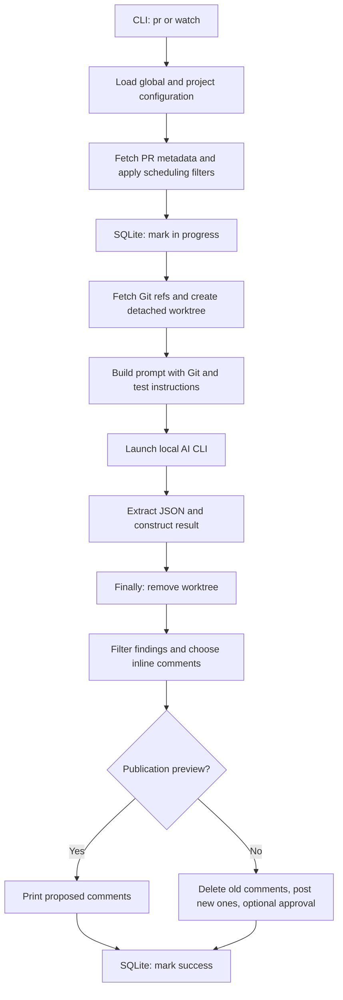

# reviewd implementation study

Date: 2026-09-15 UTC. Status: source study and offline characterization complete;
the bounded Git-preflight follow-up in #169 is implemented and provider-free
qualified. Other follow-ups remain planning guidance only.

## Scope and evidence

Inspected [simion/reviewd](https://github.com/simion/reviewd/tree/c9c6227b725fda62db5bba7945b0139d18b2ddae)
at `c9c6227b725fda62db5bba7945b0139d18b2ddae`, package version 0.7.2, MIT.
Independent Reviewer baseline: `9e6f038e38e9d71b32450434a7fdb89e3c64ae2b`.
Source was cloned into `/private/tmp/reviewd-comparison-20260915` and inspected
directly, including orchestration, Git, CLI invocation, prompts, configuration,
provider adapters, publication, state, wizard, tests, and CI.

Upstream's locked dependencies were installed without building/installing its
package. Its 62 tests passed on macOS with Python 3.14.6 in 0.76 seconds.
Eleven additional observations were reproduced with local Git fixtures, a
short-lived Python child, SQLite, and mocked hosting/model boundaries. Those
probes are characterization tests: passing means the recorded behavior exists,
not that it is desirable. No AI CLI, paid provider, live PR publication, or
interactive trust flow was exercised. This is not a comprehensive security
audit, platform qualification, or review-accuracy evaluation.

## How the code actually works



### 1. Configuration and scheduling

`cli.py` exposes one-shot `pr`, polling `watch`, repository listing, and history.
`config.py` merges global and project configuration; project policy is read from
the main local checkout rather than the PR worktree. However, reading project
configuration calls `_sync_project_config`: it fetches, checks clean status and
upstream divergence, and can fast-forward the entire checkout. This is not a
config-only read or a check that only `.reviewd.yaml` changed.
[Configuration source](https://github.com/simion/reviewd/blob/c9c6227b725fda62db5bba7945b0139d18b2ddae/src/reviewd/config.py#L212).

`daemon.py` uses separate pools for fetching metadata and reviewing PRs. It
filters drafts, title/author patterns, previously reviewed source commits,
cooldowns, and diff-size thresholds. Worker count limits active reviews; it does
not impose an explicit queue-length cap. The in-flight key is `(repo_slug, pr_id)`;
SQLite adds source commit, but neither key includes hosting identity/workspace.
Bitbucket keeps workspace separately from its repository slug.

`min_diff_lines_update` selects a different threshold after a previous success,
but `get_diff_lines` still measures the full current PR diff against destination,
not changes since the last reviewed commit. Thus it is not incremental evidence
capture. Startup can mark skipped existing PRs successful without reviewing them.
[Scheduler](https://github.com/simion/reviewd/blob/c9c6227b725fda62db5bba7945b0139d18b2ddae/src/reviewd/daemon.py#L154),
[state](https://github.com/simion/reviewd/blob/c9c6227b725fda62db5bba7945b0139d18b2ddae/src/reviewd/state.py#L18).

### 2. Git capture and evidence

`create_worktree` fetches source/destination branch names, tries provider PR refs
on failure, and chooses an existing `origin/<source>` first, then `FETCH_HEAD`,
then supplied commit. Detached worktrees and per-repository locks are practical
ways to avoid disturbing tracked working files and serialize shared Git work.
They do not prove the chosen checkout equals the recorded PR source commit.
Destination is also referenced by a mutable remote branch in the prompt.
[Git implementation](https://github.com/simion/reviewd/blob/c9c6227b725fda62db5bba7945b0139d18b2ddae/src/reviewd/reviewer.py#L103).

Evidence selection belongs mostly to the AI: compute merge-base and diff, read
changed files, follow related code, inspect commit evolution. No runner-owned
inventory proves which files or byte ranges the model saw. This offers useful
exploration freedom but does not establish complete coverage or snapshot identity.
Our C1/C2 work should capture that usefulness through bounded frozen evidence.

### 3. Prompt and review process

One prompt combines PR metadata, project guidance, review instructions, optional
test commands, and optional approval rules. It requests concrete scenarios,
actionable fixes, appropriate severity, and permits an empty findings list.
These are useful prompt properties, but not enforcement mechanisms.

It asks the model to read HEAD-side `CLAUDE.md`, `GEMINI.md`, or `AGENTS.md` and
inspect commit messages before assessing code. There is no separately persisted
blind stage, fresh claim verifier, or author reconciliation. The instruction to
avoid re-suggesting reverted approaches treats author history as persuasive
context. If we ever admit change evolution, it belongs in labeled post-blind
evidence; a revert is not proof that an approach was incorrect.
[Prompt](https://github.com/simion/reviewd/blob/c9c6227b725fda62db5bba7945b0139d18b2ddae/src/reviewd/prompt.py#L5).

Configured checks are inserted into this prompt. The runner does not execute each
named check or collect a structured execution record. `tests_passed` is a model
field rendered as a test result. Actual CLI tools may run tests, but the review
result does not independently bind command, exit, environment, and output.

### 4. AI CLI transport and lifecycle

Non-interactive backends share `_build_cli_command` and `invoke_cli`. Claude and
Gemini receive prompt arguments; Codex receives stdin, a schema file, and an
output file. These differences are contained in one module. Codex receives an
explicit output schema; local parsing still needs its own validation.

The subprocess starts a new session and drains stderr in a thread. Normal output
handling blocks on `stdout.read()` before calling `wait(timeout)`, so that timeout
does not protect the read. Captured stdout/stderr also lack explicit byte caps.
Global shutdown kills process groups, whereas the normal timeout path terminates
only the direct child. These are distinct lifecycle paths requiring tests.
[Transport](https://github.com/simion/reviewd/blob/c9c6227b725fda62db5bba7945b0139d18b2ddae/src/reviewd/reviewer.py#L498).

Interactive Claude uses a PTY, polls an output file, watches selected error
banners, and has a monotonic deadline. It also modifies `~/.claude.json` to
pre-accept directory trust and runs with skipped permissions. Environment is
inherited except for removal of `CLAUDECODE`. Disposable worktrees isolate file
placement, not credentials, host permissions, or process capabilities. No claims
about current CLI billing or sandbox guarantees were independently qualified.
[Interactive path](https://github.com/simion/reviewd/blob/c9c6227b725fda62db5bba7945b0139d18b2ddae/src/reviewd/reviewer.py#L376).

### 5. Parsing, publication, and policy

JSON extraction selects the last fenced block or a raw object, permits control
characters, and attempts trailing-comma repair. `parse_review_result` supplies
missing fields, downgrades unknown severity, and coerces approval with `bool`.
There is no authoritative local full-schema or source-anchor validation here.
Preserving a failed raw response is useful; converting malformed output into a
valid-looking result is not an acceptable substitute for our validation boundary.
[Parser](https://github.com/simion/reviewd/blob/c9c6227b725fda62db5bba7945b0139d18b2ddae/src/reviewd/reviewer.py#L630).

`post_review` deduplicates by file/line/title, filters severities, selects inline
findings, and computes presentation. Exceeding the inline limit moves all findings
to summary rather than picking the first N. Non-preview publication deletes old
comments first, posts each inline comment, posts summary, and optionally approves.
Only intended inline selection controls summary exclusion, not actual delivery.
Approval gates receive the already-filtered result. Unknown diff size does not
block a configured maximum-size gate.
[Publication](https://github.com/simion/reviewd/blob/c9c6227b725fda62db5bba7945b0139d18b2ddae/src/reviewd/commenter.py#L161).

`GitProvider` is a compact hosting abstraction for listing/getting PRs,
posting/deleting comments, and approving. GitHub comments use source commit when
supplied, but approval sends only `event: APPROVE`, with no commit identity.
No PR-head recheck occurs between assessment and publication in this path.
[Hosting interface](https://github.com/simion/reviewd/blob/c9c6227b725fda62db5bba7945b0139d18b2ddae/src/reviewd/providers/base.py#L8),
[GitHub adapter](https://github.com/simion/reviewd/blob/c9c6227b725fda62db5bba7945b0139d18b2ddae/src/reviewd/providers/github.py#L89).

## Reproduced observations

These describe the pinned upstream revision, not defects inferred in our engine.
The retained [probe](reviewd/probe_reviewd.py) checks source commit before running.

| Probe | Observed result | Lesson |
| --- | --- | --- |
| Missing result fields | `{}` constructs empty findings and summary | Fail incomplete responses locally |
| String approval | `"false"` becomes `True` | Validate booleans before policy |
| Inline post failure | Unique issue detail absent from summary | Summary membership follows delivery receipts |
| Comment deletion failure | Failed deletion ID removed from state | Keep retryable delivery records |
| Hidden critical finding | Filtering critical severity permits approval | Display filters cannot alter semantic gates |
| Unknown diff size | Both `None` and `-1` pass maximum-size gate | Unknown is not within limit |
| Publication dry-run | Reviewer invoked; no post; durable success recorded | Distinguish provider-free preflight, review, and publish preview |
| Interrupted state | Reopened `in_progress` suppresses review | Model interruption explicitly; use bounded recovery policy |
| Startup skip | Existing PR marked success; later `review_existing` still sees success | Skipped, assessed, and delivered are different states |
| Child timeout | 300 ms child succeeds with 50 ms timeout; 335 ms measured | Bound blocking I/O before waiting for exit |
| Moving branch | Real local worktree uses newer branch head than supplied PR SHA | Freeze and verify exact target before review |

The inline failure was injected into a fake provider; no real comments were lost.
The interrupted-state probe reopens a database after an unfinished row, simulating
retained state rather than killing a live reviewer. The branch probe uses a local
bare remote with two feature commits; no fork-host API behavior was simulated.
Timing values are observations, not performance targets.

## Useful design choices and how to adapt them

- **Guided setup:** `wizard.py` detects current repository/remotes and offers
  guided or sample-config setup. Apply this to existing friendly-operations
  Slices 5/6; avoid new duplicate onboarding work. Resolve settings and show a
  concrete dry-run handoff. Do not inherit automatic checkout updates or trust
  changes. [Wizard](https://github.com/simion/reviewd/blob/c9c6227b725fda62db5bba7945b0139d18b2ddae/src/reviewd/wizard.py#L438).
- **Focused exploration:** read declarations and related callers as needed.
  Qualify frozen read/search and reverse references through #162/#163 with
  quality/cost comparisons; unrestricted workspace access is not required.
- **Compact feedback:** keep correction and exact location easy to scan.
  Presentation can reduce visible volume while full artifacts and outcome
  accounting remain intact. Semantic deduplication already belongs to #168.
- **Small hosting adapter:** isolate provider-specific API mechanics. Extend
  eventual contracts with explicit host/repository identity, BASE/HEAD, source
  side/range, report identity, and publication receipt rather than moving these
  concerns into the model provider or review orchestrator.
- **Operational simplicity:** local polling avoids webhook infrastructure.
  Keep it optional and deferred; start future hosting with one-shot PR review
  and publication preview before concurrency, retries, and continuous scheduling.
- **Resource ownership:** temporary worktrees, process tracking, and `finally`
  cleanup provide clear ownership. Strengthen them with exact snapshot materialization,
  deadlines, output limits, process-tree cleanup, and crash recovery evidence.

## Changes to our backlog and direction

| Learning | Destination | Scope |
| --- | --- | --- |
| Every blocking phase needs a bound | [#169](https://github.com/dills122/independent-reviewer/issues/169) | Small fix for independently reproduced safe-directory preflight gap |
| Restrained terminal presentation | [#170](https://github.com/dills122/independent-reviewer/issues/170) | Opt-in compact view over complete reports |
| Guided setup and clear preview | Existing #103/#149; friendly operations plan | Acceptance refinements, no duplicate issue |
| Exploratory evidence and observed checks | Existing #162/#163/#164; correctness plan | Qualification cases and provenance boundaries |
| Finding accuracy and deduplication | Existing #160/#161/#168 | No claim that upstream's tests measure semantic accuracy |
| Hosting identity, publication, scheduler recovery | Architecture roadmap | Deferred direction requiring contracts before consumers |
| Local CLI model backends | Research decision only | Defer until independence, isolation, output, usage, and budget contracts can be met |

### Further review and action

This study records evidence and proposed acceptance criteria. It now links the
completed #169 product regression; merging it does not complete the other
follow-ups or qualify a broader runtime capability.

- [x] Implement [#169](https://github.com/dills122/independent-reviewer/issues/169)
  as a bounded Git preflight fix. Fresh-process
  [product regressions](../../test/snapshot/git-command.test.ts) cover exact
  NUL-delimited values and empty multi-value resets, configured/unset/failed
  reads, accepted and rejected resource boundaries, producer closure,
  concurrent callers, and all three Git wrappers.
- [ ] Evaluate [#170](https://github.com/dills122/independent-reviewer/issues/170)
  within the [friendly operations plan](../plans/2026-09-11-friendly-reviewer-operations-plan.md).
  Keep the compact view optional and verify unchanged report contents and outcomes.
- [ ] Carry the exploration and process-lifecycle cases into C1/C2/D of the
  [correctness delivery plan](../plans/2026-09-14-correctness-engineering-review-plan.md).
  Retain its quality-corpus and claim-adjudication prerequisites; record measured
  benefits and regressions before promoting new evidence or execution paths.
- [ ] When hosting is requested, review the
  [hosting acceptance requirements](../architecture-and-roadmap.md#reviewd-informed-follow-up-direction)
  and freeze identity, publication receipt, scheduling, and recovery contracts
  before selecting a database or implementing continuous polling.

Future reviews should distinguish reproduced behavior from source-only concerns,
rerun probes against the stated revisions, and update this action list with PR or
validation links. New observations against newer upstream revisions need their
own source identity; do not silently overwrite this study's baseline.

The retained [historical timeout probe](reviewd/probe_git_config_timeout.py) uses
Node.js 24.19.0 and a fake Git that sleeps 300 ms for safe-directory discovery.
Before #169, a `runGit` call configured for 20 ms returned after approximately
497 ms because all three wrappers awaited an unbounded discovery promise before
starting their command timers. That observation remains source-study evidence.

#169 deliberately gives shared process-wide discovery a separate one-second
ceiling, so the probe's 300 ms sleep remains below the new bound and is not a
current regression gate. The product tests linked above supersede it for current
behavior. Keep the probe only to reproduce the historical baseline; a passing
probe no longer demonstrates the original unbounded defect.

No upstream code was copied into product runtime. Retained probe scripts are
original research helpers, outside application tests and bootstrap-owned scripts.
No new dependency, model backend, daemon, publication capability, or paid
experiment is authorized by these planning updates.

## Reproduction

From a clone checked out at the exact upstream commit, install its locked test
dependencies and run its suite. Commands below intentionally do not install the
reviewd package or invoke its CLI entry point. Dependency installation needs
network; subsequent tests/probes use local fixtures and mocked services.

```sh
git clone https://github.com/simion/reviewd.git /tmp/reviewd-study
git -C /tmp/reviewd-study checkout --detach c9c6227b725fda62db5bba7945b0139d18b2ddae
cd /tmp/reviewd-study
uv sync --frozen --no-install-project --no-build
env -i PATH=/usr/bin:/bin PYTHONPATH=src .venv/bin/python -m pytest tests -q
env -i PATH=/usr/bin:/bin PYTHONPATH=src GIT_CONFIG_NOSYSTEM=1 GIT_CONFIG_GLOBAL=/dev/null \
  .venv/bin/python /absolute/path/to/independent-reviewer/docs/research/reviewd/probe_reviewd.py
python3 /absolute/path/to/independent-reviewer/docs/research/reviewd/probe_git_config_timeout.py \
  /absolute/path/to/node24
```

Use a disposable checkout. The probes intentionally reproduce current behavior,
including success-state mutation in temporary SQLite and temporary worktree
creation/removal. They do not execute the interactive pretrust function or access
real provider credentials. Reproduction assumes a Unix host with Git and
`/bin/sleep`; it does not qualify Windows.

## Validation of this research change

- Upstream suite: 62 passed; retained characterization probe reproduced all
  eleven observations after copying into this repository.
- Local fake-Git probe reproduced the preflight delay on Node.js 24.19.0.
- Research helpers passed Ruff's default check; no product dependencies added.
- Committed-context check (`python3 -B scripts/check-ai-context.py --ci`) passed.
- Additional machine-local context check reported missing shared skills in this
  worktree. Local AI Central installation was not changed by this research task.
- Product runtime change is limited to #169's Git preflight lifecycle; no public
  contract, dependency, provider behavior, or paid path changed. Focused and
  complete provider-free application gates cover the fix.
